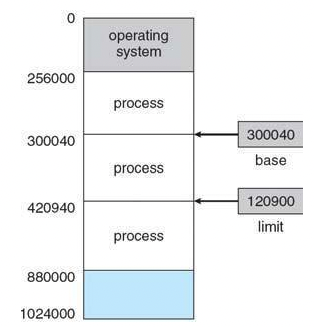
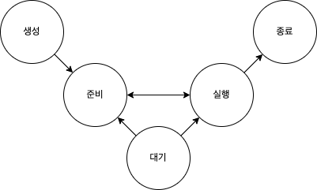

# 소프트웨어 세상을 여는 컴퓨터 과학 - 김종훈

### 개요

김종훈님의 서적 ‘소프트웨어 세상을 여는 컴퓨터 과학’ 을 읽고 정리했습니다.

---

### 1장: 컴퓨터의 개요

- 컴퓨터 시스템은 하드웨어와 소프트웨어로 구성됩니다.
    - 하드웨어는 컴퓨터를 구성하는 물리적인 기계 장치입니다.
        - 중앙처리장치, 기억장치, 입력장치, 출력장치로 구성됩니다.
    - 소프트웨어는 하드웨어에게 명령을 수행하라고 지시하며 이를 제어합니다.
        - 시스템 SW, 응용 SW로 나눠집니다. 둘은 수행하는 일이 다릅니다.
        - 시스템 SW는 하드웨어 자원을 효율적으로 관리하고 사용자 인터페이스를 지원합니다.
        - 응용 SW는 사용자가 필요하는 특정 업무를 수행하도록 도와줍니다.

---

### 2장: 데이터 표현과 디지털 논리

- 컴퓨터가 처음부터 2진수를 사용했던 것은 아니었습니다. 하지만 현재는 연산 처리 능력의 저하와 비안정성ㄷ의 문제로 인해 2진수를 사용합니다.
- 컴퓨터는 모든 정보를 2진수로 표현합니다. 그 중 문자는 **미리 약속된 코드 체계를 통해 표현**합니다. 대표적으로는 아스키 코드와 유니코드가 존재합니다.
    - 아스키 코드는 **A**merican **S**tandard Code for **I**nformation **I**nterchange의 약자입니다.
    - 위 이름에서 보이다시피 아스키 코드는 다양한 나라의 언어를 표현하기엔 어려움이 많았습니다. 이를 해결하기 위해 유니코드가 등장했습니다.
- 데이터의 효율적인 저장과 전송을 위해선 크기를 줄이는 것이 핵심입니다. 이를 우리는 압축이라고 말합니다. 텍스트 데이터에는 대표적인 압축 기술으로 **허프만 코딩**이 있습니다.
    - 사용 빈도를 기준으로 자주 사용되는 문자는 짧은 비트로, 적게 사용되는 비트는 상대적으로 긴 비트로 지정해 표현하는 기법입니다.
- 정수는 2의 보수 표기법을 통해 표현합니다. 컴퓨터는 특이하게 덧셈과 뺄셈 모두 더하기를 통해 수행합니다.
- 실수는 단일 정밀도와 이중 정밀도 형식을 통해 표현할 수 있습니다.
    - 실수 중 지수를 표현할 땐 음의 지수를 나타내기 위해 **바이어스 된 지수**로 표현합니다.
    - 실수를 표현하기 위한 절차 중 ‘가수 자리 조절'에서 가수 부분의 자리가 부족해 가수 일부분이 절단되는 오류를 **라운드 오프 오류(Round off error)**라고 합니다.
- 컴퓨터가 알아들을 수 있는 언어는 단 하나 ‘기계어'이며 0,1을 통해 표현됩니다. 0과 1에 대한 연산을 우린 **불 대수 연산**이라고 합니다.
    - OR, AND, NOT로 총 3개의 연산자가 존재합니다.
    - 위 연산자를 수행하는 연산을 논리 연산이라 부르며 이를 수행하는 회로를 **게이트**라고 부릅니다.
        - OR, AND, NOT과 같은 기본 게이트와 이를 확장한 XOR, NOR, NAND 게이트가 존재합니다.
        - 같은 결과를 도출하더라도 게이트 구성에 따라 연산 성능의 차이가 존재합니다.

---

# 소프트웨어 세상을 여는 컴퓨터 과학 - 김종훈

### 개요

김종훈님의 서적 ‘소프트웨어 세상을 여는 컴퓨터 과학’ 을 읽고 정리했습니다.

---

### 1장: 컴퓨터의 개요

- 컴퓨터 시스템은 하드웨어와 소프트웨어로 구성됩니다.
    - 하드웨어는 컴퓨터를 구성하는 물리적인 기계 장치입니다.
        - 중앙처리장치, 기억장치, 입력장치, 출력장치로 구성됩니다.
    - 소프트웨어는 하드웨어에게 명령을 수행하라고 지시하며 이를 제어합니다.
        - 시스템 SW, 응용 SW로 나눠집니다. 둘은 수행하는 일이 다릅니다.
        - 시스템 SW는 하드웨어 자원을 효율적으로 관리하고 사용자 인터페이스를 지원합니다.
        - 응용 SW는 사용자가 필요하는 특정 업무를 수행하도록 도와줍니다.

---

### 2장: 데이터 표현과 디지털 논리

- 컴퓨터가 처음부터 2진수를 사용했던 것은 아니었습니다. 하지만 현재는 연산 처리 능력의 저하와 비안정성ㄷ의 문제로 인해 2진수를 사용합니다.
- 컴퓨터는 모든 정보를 2진수로 표현합니다. 그 중 문자는 **미리 약속된 코드 체계를 통해 표현**합니다. 대표적으로는 아스키 코드와 유니코드가 존재합니다.
    - 아스키 코드는 **A**merican **S**tandard Code for **I**nformation **I**nterchange의 약자입니다.
    - 위 이름에서 보이다시피 아스키 코드는 다양한 나라의 언어를 표현하기엔 어려움이 많았습니다. 이를 해결하기 위해 유니코드가 등장했습니다.
- 데이터의 효율적인 저장과 전송을 위해선 크기를 줄이는 것이 핵심입니다. 이를 우리는 압축이라고 말합니다. 텍스트 데이터에는 대표적인 압축 기술으로 **허프만 코딩**이 있습니다.
    - 사용 빈도를 기준으로 자주 사용되는 문자는 짧은 비트로, 적게 사용되는 비트는 상대적으로 긴 비트로 지정해 표현하는 기법입니다.
- 정수는 2의 보수 표기법을 통해 표현합니다. 컴퓨터는 특이하게 덧셈과 뺄셈 모두 더하기를 통해 수행합니다.
- 실수는 단일 정밀도와 이중 정밀도 형식을 통해 표현할 수 있습니다.
    - 실수 중 지수를 표현할 땐 음의 지수를 나타내기 위해 **바이어스 된 지수**로 표현합니다.
    - 실수를 표현하기 위한 절차 중 ‘가수 자리 조절'에서 가수 부분의 자리가 부족해 가수 일부분이 절단되는 오류를 **라운드 오프 오류(Round off error)**라고 합니다.
- 컴퓨터가 알아들을 수 있는 언어는 단 하나 ‘기계어'이며 0,1을 통해 표현됩니다. 0과 1에 대한 연산을 우린 **불 대수 연산**이라고 합니다.
    - OR, AND, NOT로 총 3개의 연산자가 존재합니다.
    - 위 연산자를 수행하는 연산을 논리 연산이라 부르며 이를 수행하는 회로를 **게이트**라고 부릅니다.
        - OR, AND, NOT과 같은 기본 게이트와 이를 확장한 XOR, NOR, NAND 게이트가 존재합니다.
        - 같은 결과를 도출하더라도 게이트 구성에 따라 연산 성능의 차이가 존재합니다.

---

### 3장: 컴퓨터 구조

- 컴퓨터를 구성하는 요소 중 하드웨어는 중앙처리장치(CPU), 주기억장치(RAM), 보조기억장치(HDD,SDD), 입출력장치(마우스, 키보드, 모니터, 스피커) 등이 있습니다.
    - 중앙처리장치는 크게 제어, 연산, 레지스터 집합 세 부분으로 구성됩니다. 주기억장치를 비롯한 다른 장치들과 버스로 연결되어 있으며, 프로그램 명령어를 해독하여 실행하는 일을 합니다.
        - **인출(fetch) → 해독(decode) → 실행(execute)** 순서로 명령어를 수행합니다.
    - 주기억장치는 프로그램과 실행에 필요한 데이터를 일시적으로 저장합니다. 중앙처리장치와는 버스를 통해 상호작용합니다.
        - 버스는 목적에 따라 제어 버스(쓰기 혹은 읽기를 결정), 주소 버스, 데이터 버스로 나눠집니다.
- 컴퓨터는 사용자가 컴퓨터를 사용할 수 있는 환경을 준비하기 위한 준비 단계가 필요합니다. 이를 부팅이라고 합니다.
    - 부팅은 바이오스 실행 → 부팅 프로그램 실행 → 운영체제 실행 순으로 진행됩니다.
        - 바이오스 BIOS 프로그램은 그래픽 카드 초기화, 주기억 장치, 디스크 드라이브, 키보드 등의 하드웨어 장치의 상태를 검사합니다.
        - 문제가 없으면 보조기억장치의 부트 섹터에 저장된 부팅 프로그램을 주기억장치로 이동시킵니다.
        - 부팅 프로그램이 실행되며 시스템 제어권을 넘겨받습니다. 보조기억장치에서 운영체제를 찾아 주기억장치에 올려 운영체제가 실행됩니다.
- 프로그램을 구성하는 명령어는 연산 코드와 피연산자로 구성됩니다.
    - 명령어는 데이터 전송, 연산, 분기 명령어로 나눠집니다.
        - 데이터 전송 명령어는 주기억장치와 레지스터 사이에서 데이터를 전송하라는 명령입니다. MOV, PUSH, POP 등이 있습니다.
        - 연산 명령어는 산술 연산(ADD, SUB, MUL, DIV), 논리 연산(AND, OR, NOT, XOR), 시프트(SHR, SHL, CIR, CIL) 명령어로 구분됩니다.
        - 분기 명령어는 일반적인 순차적인 실행 순서와 다르게 특정 위치로 명령어의 실행 순서를 이동시키는 명령입니다. 특정 주소로 분기하는 JUMP, 분기 후 돌아올 때 사용되는 CALL이 있습니다.

---

### 4장: 운영체제의 개요

- 운영체제는 사용자가 컴퓨터를 편리하게 사용할 수 있도록 **‘사용자 인터페이스를 제공’**하며 하드웨어의 각 장치를 관리하는 **’컴퓨터 시스템 자원 관리'** 두 기능을 수행합니다.
    - 컴퓨터 시스템 자원 중 중앙처리장치는 주기억장치에 준비된 프로그램, 프로세스를 실행합니다.
- Process is Program in Execution
    - 프로세스는 실행중인 프로그램입니다. ‘실행중’이란 것은 보조기억장치에 보관되어있던 프로그램이 주기억장치로 로드된 상태를 말합니다.
    - 프로세스는 운영체제의 실행 제어를 돕기 위한 여러 정보를 갖습니다. 이런 정보들을 담은 주머니를 **Process Control Block, PCB**라고 합니다. PCB는 아래와 같은 요소들로 이뤄져 있습니다.
        - **PID**: 프로세스만의 고유한 번호입니다. 고유값을 갖고 있어야 서로의 메모리 영역을 침범하지 않을 수 있고, 서로 통신할 때도 식별이 가능합니다.
        - **State:** 프로세스의 현재 상태를 말합니다.
            - 프로세스는 항상 CPU를 붙잡고 실행(점유)되는게 아닙니다. 가끔 CPU가 프린터, 마우스, 키보드같은 입출력 장치를 이용하게 되면 잠시 놔주어야 합니다.
            - 이 때 프로세스가 CPU를 점유하고있지 않다는 **대기 상태**를 표시하기 위해 필요합니다.
        - **Pointer**: 프로세스가 위치하고 있는 메모리 주소 정보입니다.
            - 각각의 프로세스는 고유의 영역을 갖습니다. 이 영역이 어디인지 알기 위해 필요합니다.
            
            

            
        - **Priority**: CPU를 선점할 수 있는 우선권을 말합니다.
            - 우린 state를 사용해서 CPU를 누가 점유하는지 확인할 수 있습니다. 이 때 I/O 장치가 더이상 CPU를 필요로 하지 않는다면 대기 상태였던 프로세스가 다시 CPU를 점유할 수 있도록 순서를 정해줘야 합니다. 이 때 필요한게 바로 우선권입니다.
        - **Program counter**: 하나의 프로세스 내에서 다음 차례에 수행될 명령어의 주소 값입니다.
        - **I/O information**: 프로세스가 할당받은 I/O 자원들에 대한 정보입니다.
        - **Accounting information**: CPU를 사용한 시간 정보입니다.
    - 프로세스는 실행되는 동안 총 5가지의 상태를 갖습니다.
        
        

        
        - 생성, 준비, 대기, 실행, 종료
        - 운영체제가 ‘실행 상태의 프로세스 → 준비 상태’, ‘준비 상태의 프로세스 → 실행 상태’로 변경할 땐CPU의 레지스터에 저장되어 있는 프로세스의 정보를 서로 바꾸게 되는데 이를 **컨텍스트 스위칭**이라고 합니다. 이 때 CPU는 아무런 일도 하지 못합니다. 따라서 잦은 컨텍스트 스위칭은 CPU의 이용률 저하, 즉 성능 저하를 일으킵니다.
    - 여러 개의 프로세스 실행을 통해 얻고자 하는 것은 CPU 이용률의 최대화입니다. 즉 프로세스의 실행 순서를 효율적으로 배치할수록 이용률이 올라갑니다. 이를 위한 기법을 **프로세스 스케줄링**이라고 합니다.
        - FCFS(First-come First-served) 스케줄링
        - 라운드 로빈(Round Robin) 스케줄링: 프로세스들이 돌아가며 정해진 시간 할당량동안 CPU를 점유합니다. 시간 할당량을 적절하게 설정하는 것이 성능에 매우 큰 영향을 미치며 일반적으로 100~100ms을 가집니다.
        - 우선 순위 스케줄링
- 현재 컴퓨터는 보조기억장치에 운영체제와 프로세스 하나만 로드하는 단일 연속 주기억장치보단 여러 프로세스를 영역을 나눠 저장하는 형태를 띕니다.
    - 최초, 최적, 적합 등의 메모리 할당 방식이 존재하지만 최근엔 대부분 **가상 메모리 방식**을 지원합니다.
    - 주기억장치는 생각보다 용량이 작습니다. 따라서 자신보다 큰 프로그램은 정상적으로 실행되지 않을 수 있습니다. 또한 여러 개의 프로그램을 한번에 실행해야될 때도 마찬가지입니다.
    - 이럴 때 당장 실행에 **필요한 부분만 주기억장치에 저장**하고 **나머지는 보조기억장치에 두고 동작**하도록 하는 방식이 바로 가상 메모리입니다.
        - 주기억장치에 올릴 부분을 산정하기 위해 프로그램을 일정한 크기로 나눕니다. 이 때 나누는 단위를 **페이지**라고 하며 페이지 단위로 주기억장치에 올리며 동작하는 것을 **페이징**이라고 합니다.
        - 주기억장치에 페이지가 올라갔을 때 해당되는 부분을 페이지 프레임이라고 합니다.
        - 페이지를 교체하기 위한 알고리즘은 FIFO(First In First Out), LRU(Least Recently Used), LFU(Least Frequently Used)가 있습니다.

---

### 5장: 프로그래밍 언어

- 프로그래밍 언어는 사람과 컴퓨터 사이에서 어느 쪽에 가깝게 이해되느냐에 따라서 고급 언어와 저급 언어로 나눠집니다.
    - 컴퓨터가 이해할 수 있는 기계어는 저급 언어와 어셈블리어
    - 사람이 컴퓨터에게 의사 표현을 할 수 있도록 돕는 C, Java, Python 등
        - 컴파일러와 인터프리터를 통해 기계어로 번역할 수 있습니다
- 컴퓨티 사고력이란 컴퓨터 과학을 활용해 현실의 문제를 해결하는 것입니다.
- 프로그램에서 값을 저장하는 공간을 변수라고 말합니다. 공간에 담긴 데이터이 어떤 타입인지는 자료형으로 나타냅니다.
    - 자료형에서는 기본 자료형(정수형, 실수형, 불형, 문자열형 등)과 구조적 자료형(튜플, 딕셔너리 튜플 등)이 존재합니다.
- 프로그램은 내부적으로 연산 처리를 수행합니다.
    - 연산 처리에 사용하는 연산자 종류는 아래와 같습니다.
        - 산술 연산을 수행하는 산술 연산자
        - 크기를 비교하는 비교 연산자
        - 참 거짓을 판단하는 논리 연산자
- 실행 순서를 제어하기 위한 사용하는 문장을 우린 제어구조라고 부릅니다.
    - 순차적으로 문자를 실행하는 순차구조
    - 조건식의 결과에 따라 선택적으로 실행하는 선택구조 (ex. if-else)
    - 특정 부분을 반복하여 실행하는 반복 구조 (ex. while, for)
- 반복적으로 실행되거나 공통적으로 실행되는 기능을 하나의 단위로 만든 것을 우린 함수라고 부릅니다.
    - 함수를 사용하면 재사용성을 얻을 수 있습니다.
    - 함수는 연산에 필요한 매개변수을 전달받을 수 있고 연산 결과값을 반환할 수 있습니다.

---

### 6장: 자료구조

- 프로그램이 특정 동작을 수행할 땐 동작을 가리키는 코드와 연산에 사용할 데이터가 존재합니다. 이 때 데이터를 어떻게 구조화시키느냐에 따라 성능이 달라집니다. 이 때 성능 향상을 위해 정의해놓은 구조화된 데이터를 우린 자료구조라고 부릅니다. 자료구조에는 용도와 구조화된 특징에 따라 여러 종류로 나눠집니다.
- 어떤 순서에 의해 여러 데이터가 나열된 **선형 리스트**
    - 일반적으로 조회 동작을 수행할 때 성능이 좋습니다.
    - 배열(1차원, 2차원)
- 데이터들을 노드로 표현하고 각 노드를 포인터로 연결해 관리하는 **연결 리스트**
    - 일반적으로 삽입 및 삭제 동작을 수행할 때 성능이 좋습니다.
    - 노드에 포인터가 하나인 단순 연결 리스트, 연결 리스트의 끝과 헤드를 연결한 원형 연결 리스트, 각 노드가 스스로의 앞뒤 포인터를 가리키는 이중 연결 리스트
- 데이터의 삽입과 삭제가 한 쪽 방향에서만 발생하는 **스택**
    - 가장 나중에 삽입된 노드가 가장 먼저 나오는 특성인 Last-In-First-Out, LIFO 구조입니다.
    - 배열, 연결 리스트로 구현할 수 있습니다.
- 한 쪽은 데이터 삽입, 반대쪽은 데이터 삭제를 수행하는 **큐**
    - 스택과는 반대로 가장 먼저 삽입된 노드가 가장 먼저 나오는 특성인 First-In-First-Out, FIFO 구조입니다.
    - 일반적인 큐는 내부가 비어있더라도 인덱스를 조절해주지 않으면 삽입이 불가능한 경우가 생깁니다. 이런 문제를 막기 위해 삽입 통로와 배출 통로가 이어진 원형 큐를 고려할 수 있습니다.
- 데이터 간 관계를 점과 선으로 나타낸 **그래프**
    - 각 점들을 정점, 정점과 정점을 연결하는 선을 간선, 정점에 접한 간선의 수는 차수라고 합니다.
    - 그래프는 정점을 방문하는 형태로 탐색 동작을 수행할 수 있습니다.
        - 시작 정점에서 시작해 임의의 방문하지 않는 정점부터 끝점까지 방문한 뒤 다음 정점을 같은 방식으로 탐색하는 깊이 우선 탐색 (Depth First Search)와 시작 정점을 먼저 방문하고 연결된 모든 정점을 방문한 뒤 아직 방문하지 않는 정점을 순차적으로 방문하는 넓이 우선 탐색 (Width First Search) 방식이 존재합니다.
- 노드를 계층적으로 나타내 나무를 거꾸로 뒤집은 형태를 띄는 **트리**
    - 원을 노드, 노드와 노드를 연결하는 선을 링크, 가장 최상위 노드를 루트 노드, 맨 아래 위치한 노드를 리프 노드라고 합니다.
    - 모든 노드들의 자식 노드가 두 개 이하인 트리를 우린 **이진 트리** 라고 합니다. 그 중에서도 루트 노드를 제외한 모두가 2개의 자식 노드를 갖고 있다면 **완전 이진 트리** 라고 부릅니다.
        - 이진 트리 순회는 전위(루트 → 왼쪽 → 오른쪽), 중위 (왼쪽 → 루트 → 오른쪽), 후위(왼쪽 → 오른쪽 → 루트) 순회로 나눠집니다.
    - 같은 데이터를 갖는 노드가 없고 왼쪽 서브 트리에 있는 모든 데이터가 현재 노드의 데이터가보다 작고 오른쪽 서브 트리에 있는 모든 데이터가 현재 노드보다 큰 트리를 **이진 탐색 트리** 라고 부릅니다. 간단하게는 노드의 값들이 왼쪽부터 오른쪽으로 예외없이 커지는 값들을 갖는 트리입니다.
        - 삽입, 삭제, 검색이 자주 발생하는 경우에 효율적입니다.

---

### 7장: 알고리즘

- 어떤 문제를 해결하기 위해 구성한 절차를 우린 알고리즘이라고 부릅니다. 일반적으로 효율적인 처리를 위해 구상되고 발전합니다.
- 데이터를 규칙에 따라 배열하는 알고리즘을 정렬 알고리즘이라고 부릅니다.
    - 정렬되지 않은 상태에서 가장 작은 데이터를 찾아 가장 앞의 데이터와 교환하는 선택 정렬
    - 정렬되지 않은 임의의 데이터를 이미 정렬된 부분의 적절한 위치에 삽입하며 정렬하는 삽입 정렬
    - 서로 이웃한 데이터를 비교해 가장 큰 데이터를 맨 뒤로 보내는 **버블 정렬**
    - 기준키를 중심으로 같은 값을 지니면 앞으로, 큰 값은 뒤로 보내 분리해가며 정렬하는 **퀵 정렬**
- 데이터 집합 내에서 특정 조건 혹은 성질을 만족하는 데이터를 찾는 알고리즘을 탐색 알고리즘이라고 부릅니다.
    - 원하는 데이터를 순차적으로 비교하며 찾는 선형 탐색(순차 탐색)
    - 정렬된 데이터 집합을 반으로 쪼개가며 탐색하는 이진 탐색
- 자기 자신을 호출하는 재귀 함수를 이용하는 알고리즘을 재귀 알고리즘이라고 부릅니다.
    - 일반적으로 피보나치 수열을 재귀 알고리즘을 통해 구할 수 있습니다. 위에서 언급한 퀵 정렬은 내부적으로 재귀 알고리즘을 사용해 정렬합니다.

---

### 8장: 데이터베이스

- 조직 내에서 공유하며 사용하는 데이터를 효율적으로 관리하고 저장하기 위해 사용하는 저장소를 데이터베이스라고 부릅니다. 일반적으로 우리가 사용하는 MySQL, Oracle을 데이터베이스 벤더라고 알고 있지만 정확히는 데이터베이스 관리 시스템, DBMS 벤더입니다.
    - 일반적으로 우린 데이터를 Relational DB, 관계형 데이터베이스를 주로 사용합니다.
- 테이블 형식으로 데이터를 정의한 데이터 모델을 우린 관계형 데이터 모델이라고 부릅니다.
    - 내부적으로 속성, 도메인, 차수, 튜플, 카디널리티, 릴레이션 등과 같은 속성을 가집니다.
    - 데이터 모델 내에서 사용할 수 있는 연산은 아래와 같습니다.
        - 선택, 추출, 합집합, 교집합, 차집합, 카타시안 곱, 조인
- 위 데이터 모델을 통해 데이터를 조작하고 연산할 때 우린 데이터베이스와 소통하기 위한 언어가 필요합니다. 이것을 Structured Query Language, SQL이라고 부릅니다.
    - 크게는 데이터를 정의하는 Data Definition Language(DDL), 데이터를 조작하는 Data Manipulation Language(DML)로 나뉩니다.

---

### 9장: 네트워크와 인터넷

- 우린 어떤 요소들이 서로 연결되어 구성된 형태를 네트워크라고 부릅니다. 컴퓨터 세계에선 전송 매체로 연결된 장치들의 모임을 뜻합니다.
- 규모에 따라 근거리 통신망 Local Area Network(LAN)과 원거리 통신망 Wide Area Network(WAN)으로 나뉩니다.
    - LAN에서 장치들을 연결하는 형식을 토폴로지라고 부릅니다. 이에 따라 링형, 버스형, 스타형으로 분류됩니다. 일반적으로 스타형이 가장 많이 사용됩니다.
    - 두 개 이상의 LAN이 연결된 네트워크를 WAN이라고 부릅니다. LAN을 이어주기 위해서 우린 라우터라는 장치를 사용합니다.
        - 라우터는 IP라는 식별 주소를 통해 목적지를 안내합니다.
- 인터넷으로 연결된 매체들은 IP 주소와 도메인 이름으로 식별됩니다.
    - IP 주소는 네트워크 주소와 호스트 주소로 나뉘며 총 32비트로 구성됩니다.
        - 32비트 주소 체계는 둘을 어떻게 나누냐에 따라 총 5가지 클래스로 나눠지며 목적도 구분됩니다.
        - 일반적으로 A~C가 많이 사용되고 D,E는 특수 목적을 갖는 클래스입니다.
    - 도메인 이름은 32비트의 2진수를 10진수로 변경해도 기억하기 어려우니, 문자열로 기억하기 위해서 생긴 이름입니다.
        - 이 때 도메인 이름을 기억하고 있는 장치를 Domain Name System, DNS라고 부릅니다.
- 인터넷을 통해 데이터를 전송하는 작업은 웹 브라우저와 같은 인터넷 애플리케이션이 담당합니다.
    - 브라우저는 전송할 데이터와 수신 IP, Port 정보를 OS 내부의 TCP/IP 소프트웨어에 전달합니다.
        - IP는 인터넷에 연결된 기기, Port는 기기 안에서 어떤 애플리케이션에게 전달할지를 식별합니다.
- TCP 계층은 TCP와 UDP로 구분되며 신뢰성과 속도에 따라 어떤 프로토콜을 사용할지 결정합니다.
    - 각 계층들을 통과할 때마다 필요한 정보를 전달하기 위해 헤더가 추가됩니다
        - 일반적으로 HTTP 계층은 HTTP 헤더, TCP 계층은 TCP 헤더, IP 계층은 IP 헤더, 이더넷 계층은 이더넷 프레임이 추가 할당됩니다.
    - TCP는 연결을 수립하기 위해 서로 확인하는 과정인 3 way Handshake 과정을 거칩니다.
        - SYN → SYN,ACK → ACK
- 같은 네트워크 안에서는 이더넷 프레임의 MAC 주소를 참조해서 도착한 뒤 IP 주소를 확인하고 전송이 가능합니다. 하지만 다른 네트워크라면 위에서 언급했듯 라우터를 통해 다른 네트워크로 건너가야 합니다.
    - MAC(Media Access Control) 주소는 모든 네트워크 카드에 부여된 유일 식별자값으로 LAN 상에서 실제 데이터 전송을 위해 반드시 필요한 주소입니다. 택배 기사님이 집주소를 모르면 배송이 불가능한 것과 같습니다.
        - 네트워크 카드에 내장된 ROM을 통해 얻을 수 있습니다.
        - 수신 측 MAC 주소를 알기 위해서는 ARP(Address Resolution Protocol)을 사용합니다. 내부적으로 캐싱을 통해 성능 효율을 꾀합니다.
        - 위에서 언급한 메시지들은 네트워크 카드를 지나야만 컴퓨터가 이해할 수 있는 전기 신호로 변경됩니다.
    - 이 때 라우터의 주소를 알기 위해 라우팅 테이블을 사용합니다. 최종 목적지 주소와 수신 네트워크 주소를 비교해 적합한 게이트웨이를 찾습니다.
- 네트워크 통신을 수행하며 항상 데이터가 정상적으로 전송되는 것은 아닙니다. 이 때 네트워크 시스템은 오류를 검출하기 위해 데이터 중복 전송과 중복 정보 전송 방법을 사용합니다.
    - 데이터 중복 전송은 비교를 위해 데이터를 중복해 보내는 방법입니다.
    - 중복 정보 전송은 패리티 비트와 같은 데이터에 대한 중복 정보를 보내는 방법입니다.
        - 수직 중복 검사, 세로 중복 검사, 순환 중복 검사, 체크섬이 있습니다.
